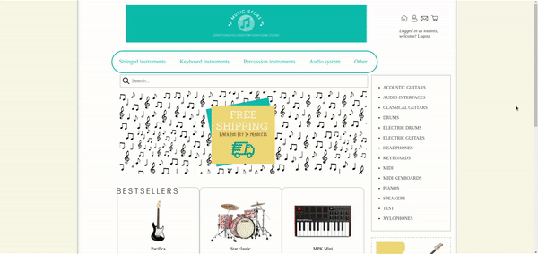

<div id="top"></div>


<br />
<div align="center">

<h3 align="center">Music Web Store</h3>

  <p align="center">
    <a href="#demo">View Demo</a>
  </p>
</div>


<!-- TABLE OF CONTENTS -->
<details>
  <summary>Table of Contents</summary>
  <ol>
    <li>
      <a href="#about-the-project">About The Project</a>
      <ul>
        <li><a href="#built-with">Built With</a></li>
      </ul>
    </li>
    <li>
      <a href="#key-functionalities">Key functionalities</a>
    </li>
    <li>
      <a href="#getting-started">Getting Started</a>
      <ul>
        <li><a href="#prerequisites">Prerequisites</a></li>
        <li><a href="#installation">Installation</a></li>
      </ul>
    </li>
    <li><a href="#store-setup">Store setup</a></li>
    <li><a href="#contact">Contact</a></li>
  </ol>
</details>


<!-- ABOUT THE PROJECT -->
## About The Project


This is my bootcamp graduation project. A model for a online shop with musical instruments. Comes with a backend built in django & a music-themed front-end. 

<b>Store setup is <a href="#store-setup">here</a></b>


## Key functionalities
* Shopping cart
* Viewed recently (session based)
* Newsletter
* Forgot password functionality 
* Discount functionality 
* Wallet
* Auth system
* Personal account 

### Built With

* [Django](https://www.djangoproject.com/)


## Demo



<!-- GETTING STARTED -->
## Getting Started

To get a local copy up and running follow these steps.

### Prerequisites

* Upgrade pip to latest version
  ```sh
  python -m pip install --upgrade pip
  ```
  
### Installation

1. Clone the repo
   ```sh
   git clone https://github.com/ikolokotronis/music-web-store.git
   ```
2. Install pip packages
   ```python
   pip install -r requirements.txt
   ```
3. Enter your database settings in settings.py. Here is an example if you want to use PSQL:
   ```python
   DATABASES = {
    'default': {
        'HOST': '127.0.0.1',
        'NAME': 'db_name_here',
        'ENGINE': 'django.db.backends.postgresql_psycopg2',
        'USER': 'user_name_here',
        'PASSWORD': 'password_here',
    }
    }
   ```
4. In settings.py change the email data to yours if you want to work with the django send_email function. *
5. Open terminal and run python manage.py runserver

"*" means optional

## Store setup
1. Install the project locally (Explained <a href="#installation">here</a>)
2. Go to the django admin panel (127.0.0.1:8000/admin/ on localhost) and fill the database using the following structure: 
* Up to 5 categories
* Up to 3 subcategories in each category (relation between subcategories and categories) 
* Up to 6 products in each subcategory (relation between products and subcategories)  
<b>Important!</b> Remember to set up relation models in django admin


<!-- CONTACT -->
## Contact

Ioannis Kolokotronis - ioanniskolokotronis1@gmail.com

Project Link: [https://github.com/ikolokotronis/music-web-store](https://github.com/ikolokotronis/music-web-store)

<!-- LICENSE -->
## License

Distributed under the MIT License. See `LICENSE.txt` for more information.

<p align="right">(<a href="#top">back to top</a>)</p>
